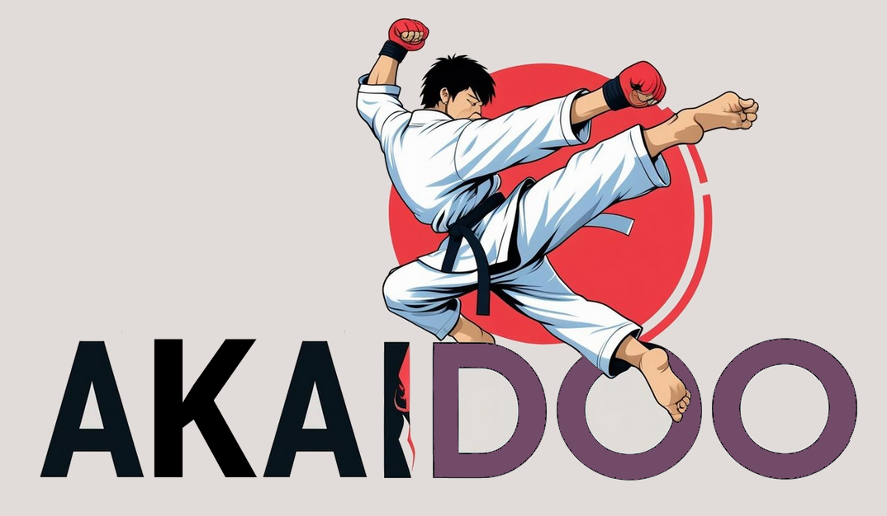

<p align="center">
  
</p>

<h1 align="center">Akaidoo - Odoo Context Dumper for AI</h1>

<p align="center">
  <a href="https://pypi.org/project/akaidoo/"></a>
  <a href="https://pypi.org/project/akaidoo/"></a>
  <a href="LICENSE"></a>
</p>

<p align="center">
  <i>The "Context Map & Dump" Workflow for Odoo AI Agents.</i>
</p>

---

**Akaidoo** is the ultimate bridge between your Odoo codebase and Large Language Models (LLMs). It extends [manifestoo](https://github.com/acsone/manifestoo) to intelligently survey, filter, prune, and dump Odoo source code, providing highly optimized context for AI-driven development.

It is designed around a powerful **2-Stage Workflow**: first **Map** the context, then **Dump** it.

## The 2-Stage Workflow

### Stage 1: The Context Map (Survey) 🗺️

Before you dump thousands of lines of code into an LLM, use Akaidoo to visualize the scope. Running Akaidoo without output flags (`-x` or `-o`) generates a hierarchical dependency tree.

```console
akaidoo sale_stock -c odoo.conf
```

**What you get:**
- A visual **Dependency Tree** showing module relationships.
- **Smart Hints**: Shows which Odoo models (`sale.order`, `account.move`) are defined in each file.
- **Smart Pruning**: Automatically greys out modules that don't contain relevant models (based on relations), keeping the focus sharp.
- **File Sizes**: Helps you estimate token usage before dumping.

### Stage 2: The Context Dump (Act) 📥

Once you're satisfied with your selection, dump the actual content. Akaidoo formats it perfectly for LLMs (with file path headers) and applies intelligent shrinking to save tokens.

```console
akaidoo sale_stock -c odoo.conf -x
```

**What you get:**
- **Clipboard Content** (or file with `-o`) ready to paste into Gemini/Claude/ChatGPT.
- **Token Optimization**: Method bodies in dependencies are "shrunk" (replaced with `pass # shrunk`) to save space while preserving API structure.
- **Auto-Expansion**: Models you are working on (or their relations) are automatically kept in full detail.

---

## 📸 The Photography Analogy: Zoom & Aperture

Think of generating an LLM context like taking a photograph. You want your subject (the code you are working on) to be sharp and detailed, while the background (dependencies) provides context without distraction. Akaidoo gives you professional camera controls:

| Concept | Akaidoo Component | Description |
| :--- | :--- | :--- |
| **The Subject** | **Target Addons** | The specific module(s) you are developing or analyzing (e.g., `sale_stock`). |
| **Focal Point** | **Selected Models** | The specific business objects being modified or analyzed. Akaidoo automatically **Auto-Expands** models that are significantly extended in your Subject, or you can manually Focus (`--focus-models`). |
| **Depth of Field** | **Related Models** | The "immediate surroundings" of your Focal Point. Parents (`_inherit`) and neighbors (`Many2one`) are kept clearer than unrelated code. |
| **Resolution** | **Shrinking** (`--shrink`) | Controls the level of detail. Low resolution (shrunken) means seeing class/method signatures but no body code. High resolution means seeing every line. |
| Framing/Cropping | **Pruning** (`--prune`) | Controls what is included in the picture. Do you want a wide-angle shot (all dependencies) or a tight macro shot (Subject only)? |
| **Cleaning the Lens** | **Exclusion** (`--exclude-profile`) | Removes "clutter" (stable framework/core modules) that the LLM already knows by heart, saving massive amounts of tokens. |

## 🎛️ Control Specifications

### Shrink Modes (`--shrink`)
*Controls the "Resolution".*

| Mode | Target Addons (Subject) | Relevant Models* (Focus+Depth) | Irrelevant Models (Background) | Use Case |
| :--- | :--- | :--- | :--- | :--- |
| **`none`** | **Full Code** | **Full Code** | **Full Code** | Deep debugging where every line matters. |
| **`soft`** | **Full Code** | **Full Code** | *Shrunken* | **Default.** Standard feature development. |
| **`medium`** | **Full Code** | *Shrunken* | *Hard Shrunk*** | High-level architectural analysis. |
| **`hard`** | *Shrunken* | *Shrunken* | *Shrunken* | Data modeling, examining API surfaces. |

*(Relevant Models = Auto-expanded/Focused models + their Parents & Relations)*
**(Hard Shrunk = Method bodies removed entirely, only fields and definitions remain)*

### Prune Modes (`--prune`)
*Controls the "Framing".*

| Mode | Scope | Description | Use Case |
| :--- | :--- | :--- | :--- |
| **`none`** | **Wide Angle** | Includes **ALL** dependencies in the tree and dump. | Debugging obscure framework issues. |
| **`soft`** | **Portrait** | **Default.** Includes Subject + dependencies containing Relevant Models. | Most tasks. Context is sufficient but focused. |
| **`medium`** | **Close-up** | Includes Subject + dependencies containing **only** Auto-Expanded models. **Dependencies are filtered to only include files defining relevant models.** | Focused work on specific business logic chains. |
| **`hard`** | **Macro** | Includes **only** the Target Addons (Subject). | Unit testing, independent module work. |

### Exclusion Profiles (`--exclude-profile`)
*Removes "well-known" clutter to focus on custom code.*

| Profile | Description |
| :--- | :--- |
| **`framework`** | **Default.** Excludes stable framework modules (`base`, `web`, `mail`, `product`, etc.). |
| **`core`** | Excludes **ALL** standard Odoo core addons. Only custom/local addons remain. |
| **`none`** | No automatic exclusions. |

**Fine-Tuning:**
- Use `--exclude addon_name` to add specific modules to the blacklist.
- Use `--rm-exclude addon_name` to remove modules from the blacklist (e.g., if you need to debug `mail` logic).

## Usage Examples

**1. The "Quick Survey" (Stage 1)**
See what `sale_timesheet` pulls in:
```console
akaidoo sale_timesheet -c odoo.conf
```

**2. The "Focused Dump" (Stage 2)**
Standard Context for `sale_timesheet`, shrinking dependencies, but keeping `project.task` fully expanded:
```console
akaidoo sale_timesheet -c odoo.conf --expand project.task -x
```

**3. Open Models and Views in Editor**
Open all relevant files (including views) in your editor:
```console
akaidoo project -c odoo.conf --include view -e
```

**4. "High-Level Architecture"**
See the data model and API surface of `account` without implementation details:
```console
akaidoo account -c odoo.conf --shrink hard -x
```

**5. Migration Context**
Gather code + migration scripts for an upgrade:
```console
akaidoo sale_stock -c odoo.conf -u ~/OpenUpgrade -o migration_context.txt
```

**6. Include Everything**
Include models, views, wizards, data, tests, etc.:
```console
akaidoo my_module -c odoo.conf --include all
```

## Contributing

Contributions are welcome! Please open an issue or submit a PR on GitHub.

## License

MIT License.